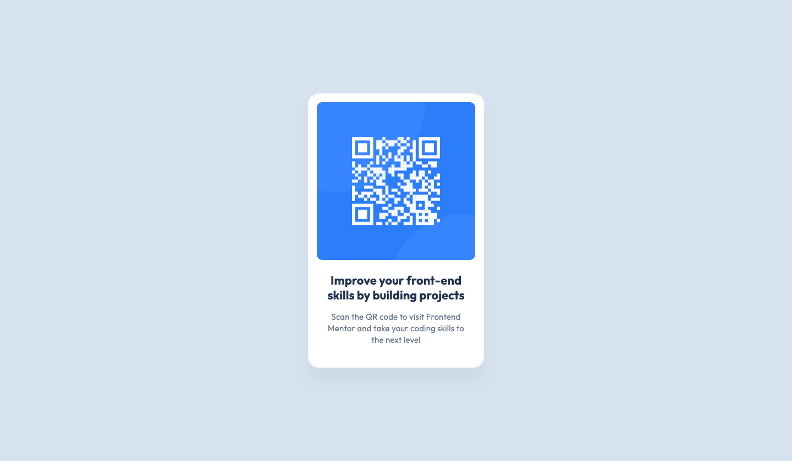

# Frontend Mentor - QR code component solution

This is a solution to the [QR code component challenge on Frontend Mentor](https://www.frontendmentor.io/challenges/qr-code-component-iux_sIO_H). Frontend Mentor challenges help you improve your coding skills by building realistic projects. 

## Table of contents

- [Overview](#overview)
  - [Screenshot](#screenshot)
  - [Links](#links)
- [My process](#my-process)
  - [Built with](#built-with)
  - [What I learned](#what-i-learned)
  - [Continued development](#continued-development)
  - [Useful resources](#useful-resources)
- [Author](#author)

## Overview

### Screenshot

### Links

- Solution/Live Site URL: [https://cocoelizabeth.github.io/frontendmentor-qr-component/](https://cocoelizabeth.github.io/frontendmentor-qr-component/)

## My process

### Built with

- Semantic HTML5 markup
- CSS custom properties
- Flexbox
- Mobile-first workflow

### What I learned

This was mainly just a warm-up/practice, so I didn't really learn anything new from it. But I did learn how to set up a GitHub page for the project. 
1. Go to the project repo and click the **Settings** button. 
2. Under **Code and automation** go to **Pages**
3. Under **Build and deployment** > **Branch** chose the branch you want to deploy from. In this case, **main**
4. Click the **Save** buttom

### Continued development

I also could have implemented this with CSS grid. I probably will just move on from this project and try some more challenging ones.

### Useful resources

- [How to Host a Website On Github Pages](https://www.youtube.com/watch?v=OltY8JIaP-4) - This helped me set up GitHub pages. He also mentions a different workflow for setting it up if it is your personal website which I may use in the future.
- [Flexbox Froggy](https://flexboxfroggy.com/) - This is an amazing resource/game for learning CSS flexbox.

## Author

<!-- - Website - [Add your name here](https://www.your-site.com) -->
- Frontend Mentor - [@cocoelizabeth](https://www.frontendmentor.io/profile/cocoelizabeth)
<!-- - Twitter - [@yourusername](https://www.twitter.com/yourusername) -->

